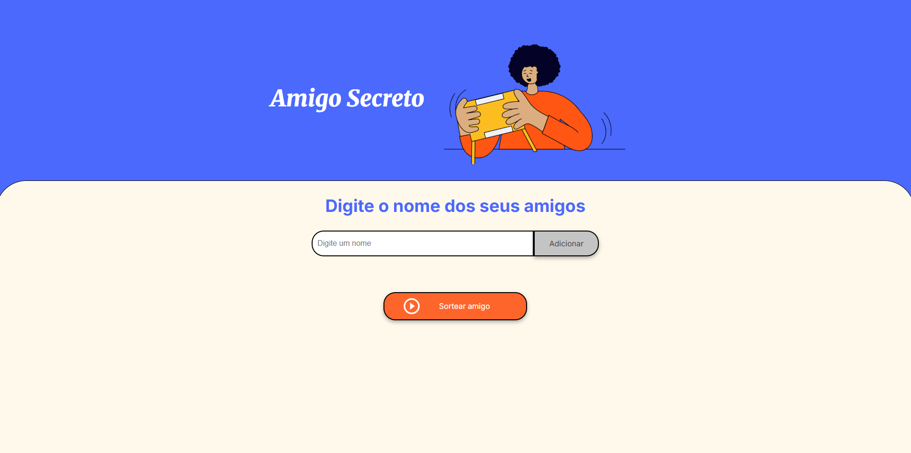
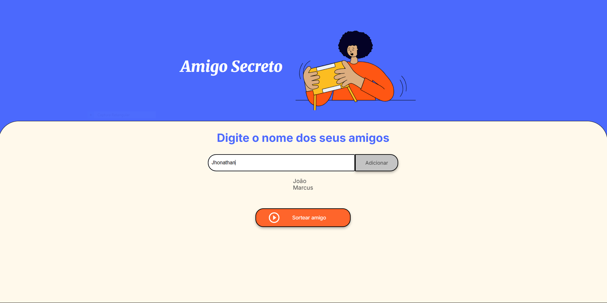
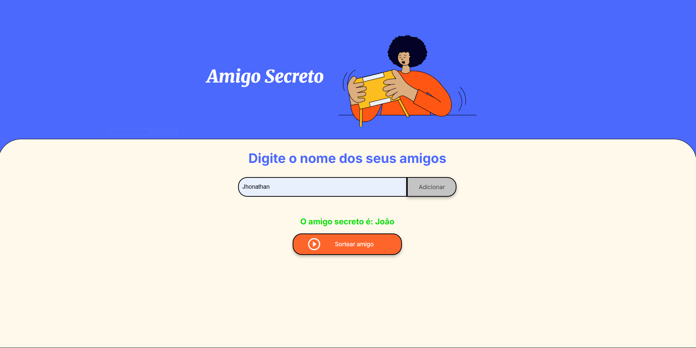

# Amigo Secreto 🎁

Este é um simples projeto de Amigo Secreto feito com **HTML, CSS e JavaScript**. Ele permite adicionar nomes de amigos, exibir a lista e sortear um amigo aleatório.

## 🚀 Funcionalidades

- Adicionar amigos à lista
- Exibir os amigos cadastrados
- Sortear um amigo aleatório
- Exibir o resultado do sorteio na tela

## 📸 Prints do Projeto





## 📂 Estrutura do Projeto

```
📁 amigo-secreto
│-- 📄 index.html  # Estrutura da página
│-- 📄 style.css   # Estilos da página
│-- 📄 app.js      # Lógica do sorteio e manipulação do DOM
│-- 📁 assets      # Imagens e ícones
```

## 🛠️ Como Usar

1. Clone este repositório:
   ```sh
   git clone https://github.com/Vick-R/challenge-frontend-allura
   ```
2. Acesse a pasta do projeto:
   ```sh
   cd amigo-secreto
   ```
3. Abra o arquivo `index.html` no navegador.

## 🔧 Tecnologias Utilizadas

- **HTML5**
- **CSS3**
- **JavaScript**

## 🧩 Desenvolvimento Pessoal

🔹 Dificuldade 1: Manipulação do DOM

--Desafio: Inicialmente, tive dificuldades para atualizar dinamicamente a exibição da lista e remover os itens corretamente após o sorteio.

--Solução: Pesquisei sobre innerHTML e createElement() para entender melhor como criar e substituir elementos na DOM. Testei diferentes abordagens até encontrar a mais eficiente.

🔹 Dificuldade 2: Sorteio sempre pegava o primeiro item

--Desafio: O sorteio só retornava o primeiro item da lista em vez de um nome aleatório.

--Solução: Identifiquei que estava acessando o índice errado e corrigi o cálculo do índice aleatório usando Math.floor(Math.random() * amigos.length). Isso garantiu um sorteio justo.

🔹 Dificuldade 3: Organização do Código

-Desafio: Meu código estava confuso e difícil de entender, com funções mal organizadas.

--Solução: Estruturei melhor as funções e adicionei comentários para facilitar a leitura. Também dividi algumas funções para que cada uma tivesse uma responsabilidade clara.

🔥 Próximos Passos

--Melhorar a responsividade da interface.

--Adicionar a opção de remover nomes da lista antes do sorteio.

--Implementar uma animação para o sorteio.


## 📜 Licença

Este projeto está sob a licença MIT - sinta-se livre para utilizá-lo e modificá-lo como quiser! 🎉

---

Feito com ❤️ por [Victoria Rolim](https://github.com/Vick-R/).
